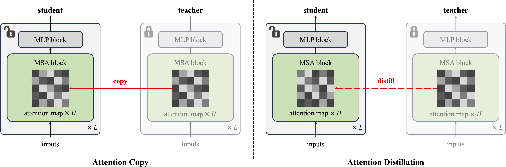

## Attention Transfer: A PyTorch Implementation

<p align="center">
  
</p>


This is a PyTorch/GPU reimplementation of the NeurIPS 2024 paper [On the Surprising Effectiveness of Attention Transfer for Vision Transformers](https://arxiv.org/abs/2411.09702):
```
@inproceedings{AttentionTransfer2024,
  title     = {On the Surprising Effectiveness of Attention Transfer for Vision Transformers},
  author    = {Li, Alexander Cong and Tian, Yuandong and Chen, Beidi and Pathak, Deepak and Chen, Xinlei},
  booktitle = {The Thirty-eighth Annual Conference on Neural Information Processing Systems},
  year      = {2024} 
}
```

* The original implementation was in Jax+TPU. This reimplementation is in PyTorch+GPU.

* This repo is a modification of the [MAE repo](https://github.com/facebookresearch/mae).  Refer to that repo for detailed installation and setup.

### Installation
```
conda env create -f environment.yml
```

### Training student with pre-trained teacher 
Obtain pre-trained MAE checkpoints from [here](https://github.com/facebookresearch/mae). 

**Attention Distillation**

To train with multi-node distributed training, run the following on 8 nodes with 8 GPUs each:
```
python submitit_finetune.py \
    --job_dir ${JOB_DIR} \
    --nodes 8 \
    --batch_size 32 \
    --model dual_vit_large_patch16 --mode distill --end_layer -6 --atd_weight 3.0 \
    --finetune mae_pretrain_vit_large.pth --resume allow \
    --epochs 200 --ema 0.9999 \
    --blr 1e-4 --layer_decay 1 --beta2 0.95 --warmup_epochs 20 \
    --weight_decay 0.3 --drop_path 0.2 --reprob 0.25 --mixup 0.8 --cutmix 1.0 \
    --dist_eval --data_path ${IMAGENET_PATH}
```

**Attention Copy**
```
python submitit_finetune.py \
    --job_dir ${JOB_DIR} \
    --nodes 8 \
    --batch_size 32  \
    --model dual_vit_large_patch16 --mode copy \
    --finetune mae_pretrain_vit_large.pth --resume allow \
    --epochs 100 --ema 0.9999 \
    --blr 1e-3 --min_lr 2e-3 --layer_decay 0.75 --beta2 0.999 \
    --weight_decay 0.05 --drop_path 0 --reprob 0.25 --mixup 0.8 --cutmix 1.0 \
    --dist_eval --data_path ${IMAGENET_PATH}
```


### License

This project is under the CC-BY-NC 4.0 license. See [LICENSE](LICENSE) for details.
